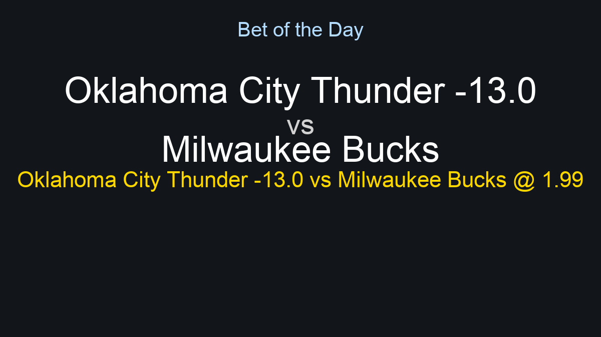

# Latest Predictions

## NBA (2026-02-12)
```
Date: 2026-02-12

Oklahoma City Thunder vs Milwaukee Bucks
Home odds: 1.16, Away odds: 5.6, O/U: 215.5
Spreads: Home -13.0 (1.99), Away 13.0 (1.91)
------
Utah Jazz vs Portland Trail Blazers
Home odds: 3.35, Away odds: 1.34, O/U: 239.5
Spreads: Home 7.5 (1.91), Away -7.5 (1.93)
------
Los Angeles Lakers vs Dallas Mavericks
Home odds: 1.31, Away odds: 3.6, O/U: 234.5
Spreads: Home -7.5 (1.94), Away 7.5 (1.94)
------

AI Analysis Summary:
Here are your NBA betting insights for today's slate, ranked by confidence:

### High Confidence

**Oklahoma City Thunder -13.0 vs Milwaukee Bucks @ 1.99**
The Thunder are playing exceptional basketball at home, driven by Shai Gilgeous-Alexander's MVP-caliber play and a stifling defense. The Bucks are struggling on the road, showing defensive lapses and potential fatigue, despite Giannis Antetokounmpo's efforts.

**Over 239.5 vs Portland Trail Blazers @ 1.94**
This matchup features two teams, the Jazz and Blazers, known for their fast pace and defensive shortcomings, creating a high-scoring environment. Expect both Lauri Markkanen and Anfernee Simons to contribute heavily to an offensive outburst.

**Over 234.5 vs Dallas Mavericks @ 1.98**
The Lakers and Mavericks both possess immense offensive talent with LeBron James, Anthony Davis, Luka Doncic, and Kyrie Irving leading the charge. Defensive lapses are common for both squads, paving the way for a high-octane scoring battle.

### Leans

**Portland Trail Blazers -7.5 vs Utah Jazz @ 1.93**
The Trail Blazers, with their consistent offensive production from players like Anfernee Simons, face a Jazz team on a significant losing streak that struggles to contain opponents defensively. Portland should control the game and secure a comfortable road victory against a vulnerable Jazz lineup.

**Los Angeles Lakers -7.5 vs Dallas Mavericks @ 1.94**
The Lakers are formidable at home, with Anthony Davis dominating inside and LeBron James orchestrating their offense efficiently. While Luka Doncic and Kyrie Irving are dynamic, Dallas often struggles to maintain defensive intensity and can be prone to big runs against strong home teams.

---

**Bet of the Day: Oklahoma City Thunder -13.0 vs Milwaukee Bucks @ 1.99**
The Thunder are in peak form, especially at home, showcasing a relentless offense led by Shai Gilgeous-Alexander and a suffocating team defense. The Bucks, despite Giannis Antetokounmpo's individual brilliance, have been inconsistent and defensively porous on the road, making it challenging for them to keep pace with a superior Thunder squad.

```

<p align="center">
  
</p>

## NHL (2026-02-12)
```
Date: 2026-02-12


```

(No generated NHL image found)

