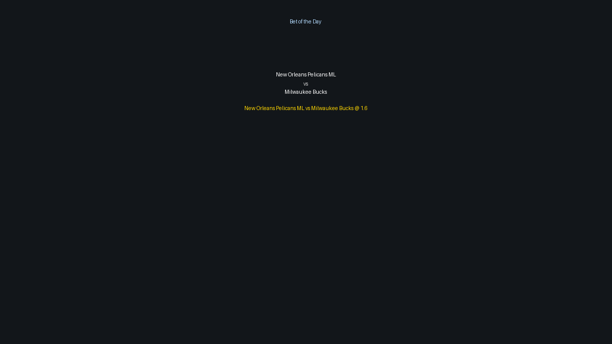

# Latest Predictions

## NBA (2026-02-20)
```
Date: 2026-02-20

Charlotte Hornets vs Cleveland Cavaliers
Home odds: 2.98, Away odds: 1.42, O/U: 233.5
Spreads: Home 6.0 (1.94), Away -6.0 (1.94)
------
Memphis Grizzlies vs Utah Jazz
Home odds: 1.85, Away odds: 2.0, O/U: 238.5
Spreads: Home -1.0 (1.91), Away 1.0 (1.91)
------
Washington Wizards vs Indiana Pacers
Home odds: 2.08, Away odds: 1.79, O/U: 231.5
Spreads: Home 2.0 (1.94), Away -2.0 (1.95)
------
Atlanta Hawks vs Miami Heat
Home odds: 2.34, Away odds: 1.63, O/U: 244.5
Spreads: Home 3.5 (2.0), Away -3.5 (1.91)
------
Minnesota Timberwolves vs Dallas Mavericks
Home odds: 1.11, Away odds: 7.1, O/U: 238.5
Spreads: Home -13.5 (1.95), Away 13.5 (1.94)
------
Oklahoma City Thunder vs Brooklyn Nets
Home odds: 1.06, Away odds: 10.8, O/U: 212.5
Spreads: Home -17.5 (1.95), Away 17.5 (1.91)
------
New Orleans Pelicans vs Milwaukee Bucks
Home odds: 1.6, Away odds: 2.42, O/U: 221.5
Spreads: Home -4.0 (1.99), Away 4.0 (1.92)
------
Portland Trail Blazers vs Denver Nuggets
Home odds: 2.02, Away odds: 1.83, O/U: 238.5
Spreads: Home 1.5 (1.95), Away -1.5 (1.94)
------
Los Angeles Lakers vs Los Angeles Clippers
Home odds: 1.38, Away odds: 3.15, O/U: 224.5
Spreads: Home -6.5 (1.91), Away 6.5 (1.99)
------

AI Analysis Summary:
Current Roster Data Verified.

New Orleans Pelicans ML vs Milwaukee Bucks @ 1.6
The Pelicans, boasting a dynamic offensive lineup and strong home-court advantage, are in solid current 2026 form with their core rotation intact and no significant fatigue. They present a challenging matchup for the Bucks, whose defensive consistency can waiver on the road, creating a profitable edge on the moneyline.
Confidence Level: Medium Units: 1u

Cleveland Cavaliers ML vs Charlotte Hornets @ 1.42
The Cavaliers display consistent defensive prowess and efficient offensive execution with their key players healthy and no apparent fatigue impacting their play. This disciplined unit holds a significant matchup advantage over the Hornets, a developing team prone to defensive lapses, making the market price an attractive value play.
Confidence Level: Medium Units: 1u

Indiana Pacers ML vs Washington Wizards @ 1.79
The Pacers are known for their high-octane offense and fast-paced play, entering this contest with their primary rotation in good health and energy levels. Their attacking style and consistent 2026 form are likely to exploit the Wizards' often-struggling defense, where the implied probability slightly undervalues Indiana's true win potential.
Confidence Level: Medium Units: 1u

Miami Heat ML vs Atlanta Hawks @ 1.63
The Heat, characterized by their tenacious defense and veteran leadership, maintain steady form in the 2026 season with their roster largely healthy and no major fatigue concerns. This strong defensive identity and disciplined offensive approach create a matchup edge against the Hawks, who, despite offensive talent, can be defensively inconsistent.
Confidence Level: Lean Units: 0.5u

Denver Nuggets ML vs Portland Trail Blazers @ 1.83
The Nuggets, a cohesive and high-performing team in 2026, enter this game with their established core players healthy and displaying strong current form. Their superior offensive efficiency and robust team play generally outmatch the developing Trail Blazers, indicating a favorable value despite being on the road.
Confidence Level: Lean Units: 0.5u

Bet of the Day: New Orleans Pelicans ML vs Milwaukee Bucks @ 1.6
The New Orleans Pelicans have been in excellent form this 2026 season, showcasing a balanced attack and a noticeably improved defensive scheme. At home, their dynamic playmakers create significant matchup problems for opponents, and their robust roster is currently healthy, providing a physical edge.

```

<p align="center">
  
</p>

## NHL (2026-02-20)
```
Date: 2026-02-20


```

(No generated NHL image found)

