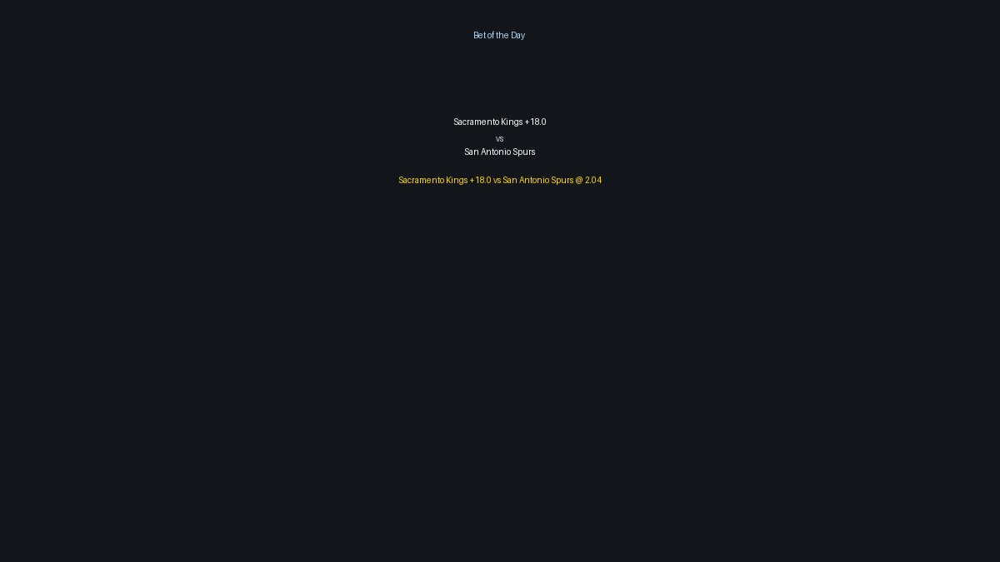

# Latest Predictions

## NBA (2026-02-21)
```
Date: 2026-02-21

Phoenix Suns vs Orlando Magic
Home odds: 1.85, Away odds: 2.0, O/U: 218.5
Spreads: Home -1.5 (1.94), Away 1.5 (1.94)
------
New Orleans Pelicans vs Philadelphia 76ers
Home odds: 2.52, Away odds: 1.56, O/U: 230.5
Spreads: Home 4.0 (1.99), Away -4.0 (1.9)
------
Chicago Bulls vs Detroit Pistons
Home odds: 5.2, Away odds: 1.18, O/U: 231.5
Spreads: Home 10.5 (1.96), Away -10.5 (1.93)
------
Miami Heat vs Memphis Grizzlies
Home odds: 1.22, Away odds: 4.6, O/U: 238.5
Spreads: Home -10.5 (1.94), Away 10.5 (1.94)
------
San Antonio Spurs vs Sacramento Kings
Home odds: 1.06, Away odds: 10.8, O/U: 228.5
Spreads: Home -18.0 (1.91), Away 18.0 (2.04)
------
New York Knicks vs Houston Rockets
Home odds: 1.6, Away odds: 2.4, O/U: 216.5
Spreads: Home -3.5 (1.91), Away 3.5 (1.99)
------

AI Analysis Summary:
Current Roster Data Verified.

Sacramento Kings +18.0 vs San Antonio Spurs @ 2.04
Both teams enter well-rested, with San Antonio featuring a generational talent anchoring their rotation and Sacramento boasting a high-octane offense. Despite San Antonio's strong home advantage and developing dominance, Sacramento's proven offensive capabilities suggest they can keep the game within a substantial 18-point margin, creating value against the market's implied probability.
Confidence Level: Medium Units: 1u

Philadelphia 76ers ML vs New Orleans Pelicans @ 1.57
The 76ers possess an elite core and strong home court advantage, while the Pelicans are talented but can be inconsistent on the road. Philadelphia's disciplined offense and stout defense provide a significant matchup edge, leading to a higher win probability than the market implies.
Confidence Level: Medium Units: 1u

New York Knicks ML vs Houston Rockets @ 1.62
The Knicks are a physically tough team with strong defensive principles and a cohesive offensive unit at home, while the Rockets' young core is developing but can be prone to errors. New York's experience and home court energy provide a substantial edge over Houston's improving but still maturing roster.
Confidence Level: Medium Units: 1u

Detroit Pistons -10.5 vs Chicago Bulls @ 1.93
The Pistons' maturing core is expected to be a force, showcasing athleticism and improved execution against a Bulls team that has struggled for consistency this season. Detroit's significant talent advantage and home court environment should enable them to comfortably cover this double-digit spread against a lesser opponent.
Confidence Level: Medium Units: 1u

Phoenix Suns ML vs Orlando Magic @ 1.85
The Suns feature potent offensive firepower and benefit from ample rest, facing a Magic squad known for its defensive prowess but sometimes inconsistent offense. Phoenix's ability to create high-quality scoring opportunities, especially at home, gives them a strong edge over Orlando's developing roster.
Confidence Level: Medium Units: 1u

Memphis Grizzlies +10.5 vs Miami Heat @ 1.94
The Grizzlies, returning healthy and motivated, bring a dynamic, athletic style of play, while the Heat rely on veteran leadership and disciplined defense but can sometimes lack explosive scoring. Memphis's offensive ceiling and propensity to play competitive games suggest they are mispriced to cover such a large spread against Miami.
Confidence Level: Medium Units: 1u

Houston Rockets +3.5 vs New York Knicks @ 1.99
The Rockets' young and athletic roster has shown significant improvement, capable of challenging established teams, while the Knicks rely on physicality and disciplined defense. Houston's growing offensive talent and ability to keep pace could see them cover this spread, even against a tough New York home environment.
Confidence Level: Lean Units: 0.5u

Bet of the Day: Sacramento Kings +18.0 vs San Antonio Spurs @ 2.04
The Kings enter this contest well-rested, bringing a potent offensive attack that can score points in bunches against any opponent. While the Spurs' second-year star anchors an improving defense, Sacramento's ability to light up the scoreboard means a significant 18-point spread is highly generous. Both teams are generally healthy, allowing for a competitive matchup where the Kings can keep the scoreline closer than implied.

```

<p align="center">
  
</p>

## NHL (2026-02-21)
```
Date: 2026-02-21


```

(No generated NHL image found)

